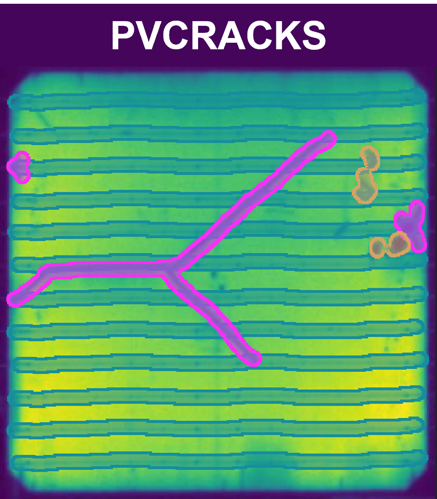
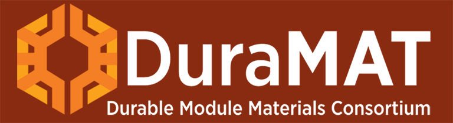
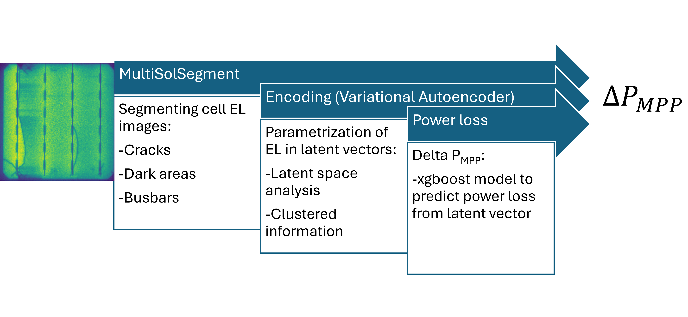

<p align="left">
  
  
</p>

# PVCracks

## Latest Release

[](https://doi.org/10.11578/dc.20240606.4)

## License

[](LICENSE)

## Overview

PVCracks is the DuraMAT project that investigates the effects of cracks on power loss in photovoltaic (PV) solar cells and tracks crack progression over time. We provide:

- Open-source cell-level imaging and electrical datasets  
- **MultiSolSegment**: segmentation of cracks, busbars, and dark areas in electroluminescence (EL) images  
- **Variational Autoencoder (VAE)**: parameterization & clustering of segmented data  
- **XGBoost model**: estimation of power loss (ΔPMPP) per cell
- **pvspice_lite**: spice toolset for simulating current-voltage (I-V) curves and building synthetic module I-Vs (more features to come) 

## Documentation

[](https://pvcracks.readthedocs.io/en/latest/index.html#)

Full online documentation is available at  
https://pvcracks.readthedocs.io/en/latest/index.html#

Below is a schematic of the repo’s architecture:



## Data & Models

All datasets, trained model weights, and additional resources are hosted on DuraMAT DataHub:  
[https://datahub.duramat.org/project/pv-crack-stress-and-power-loss](https://datahub.duramat.org/project/pv-crack-stress-and-power-loss)

- Cell-level EL & electrical data (data publication to follow)  
- MultiSolSegment training images and masks (DOI: [10.21948/2587738](https://doi.org/10.21948/2587738))  
- MultiSolSegment model weights (DOI: [10.21948/2997859](https://doi.org/10.21948/2997859))
- VAE model weights (DOI: [10.21948/2997860](https://doi.org/10.21948/2997860))

## Publications

- **MultiSolSegment**  
  In revision for *Solar Energy* (Elsevier). Preprint [10.2139/ssrn.5506469](https://dx.doi.org/10.2139/ssrn.5506469).

- **Variational Autoencoder (VAE)**  
  EUPVSEC 2024 conference proceeding  
  DOI: [10.4229/EUPVSEC2024/3BO.15.6](https://doi.org/10.4229/EUPVSEC2024/3BO.15.6)

- **Power-Loss Model (XGBoost)**  
  2025 IEEE 53rd Photovoltaic Specialists Conference (PVSC) proceeding  
  DOI: [10.1109/PVSC59419.2025.11132966](https://doi.org/10.1109/PVSC59419.2025.11132966)

## Updates

- Dec. 9th 2025: Duramat webinar is uploaded here:  
  [www.duramat.org/news-and-events/webinars](https://www.duramat.org/news-and-events/webinars)
  [Direct Link to youtube](https://www.youtube.com/watch?v=4QWsLkpUDd4)

## Installation

Clone and install:

```bash
git clone git@github.com:sandialabs/pvcracks.git
cd pvcracks

# 1. Upgrade pip, setuptools, and wheel
pip install --upgrade pip setuptools wheel

# 2. Install runtime dependencies (see requirements.txt for full list)
pip install -r requirements.txt

# 3. Install pvcracks in editable mode
pip install -e .    # enables intra-project imports

```

## Acknowledgments

Funding was provided as part of the Durable Modules Consortium (DuraMAT), an Energy Materials Network Consortium funded by the U.S. Department of Energy, Office of Energy Efficiency and Renewable Energy, Solar Energy Technologies Office under agreement number 32509. The views expressed in this article do not necessarily represent the views of the DOE or the U.S. Government. The U.S. Government retains—and the publisher, by accepting the article for publication, acknowledges—that it retains a nonexclusive, paid-up, irrevocable, worldwide license to publish or reproduce the published form of this work, or to allow others to do so, for U.S. Government purposes.

Sandia National Laboratories is a multimission laboratory managed and operated by National Technology and Engineering Solutions of Sandia, LLC, a wholly owned subsidiary of Honeywell International Inc., for the U.S. Department of Energy’s National Nuclear Security Administration under contract DE-NA0003525.

